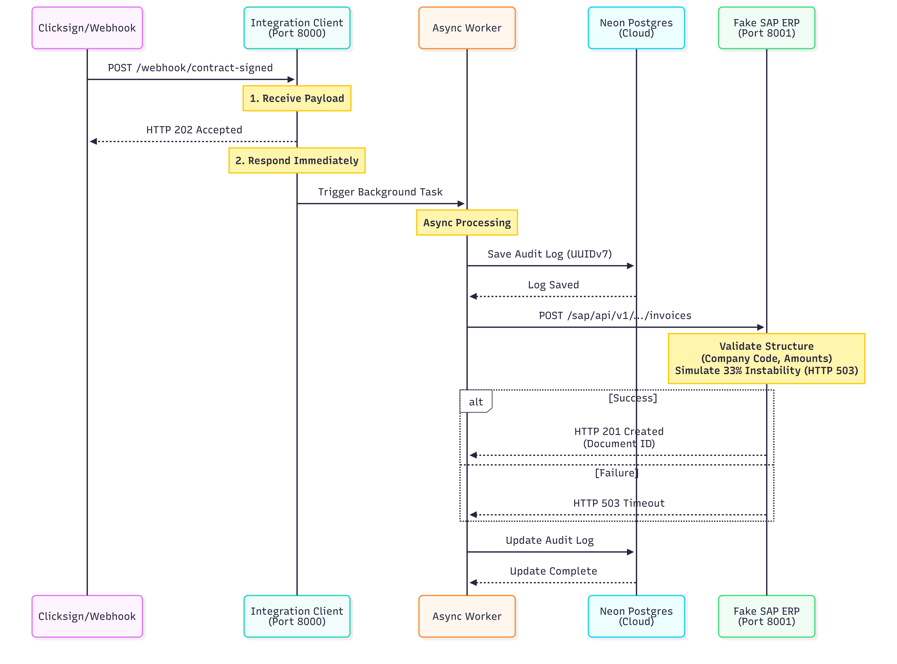

# SAP Integration Middleware 🚀

Um ecossistema de microsserviços assíncronos de alta performance desenhado para integrar plataformas de assinatura eletrônica (ex: Clicksign) ao módulo financeiro do SAP ERP. 

O projeto foi construído utilizando conceitos modernos de arquitetura orientada a eventos (Event-Driven), persistência relacional serverless e foco estrito em resiliência e concorrência eficiente em operações de I/O.

---

## 🏗️ Arquitetura e Fluxo do Sistema

O ecossistema é dividido de forma modular em duas aplicações totalmente independentes. O diagrama de sequência abaixo detalha como ocorre o ciclo de vida de uma requisição, desde o recebimento do webhook até a persistência assíncrona e faturamento no ERP:



### ⚡ Diferenciais Técnicos e Engenharia de Software
* **Desacoplamento de Concorrência:** O middleware liberta o cliente de origem imediatamente respondendo um status `202 Accepted`. O processamento pesado e a comunicação com o ERP ocorrem de forma assíncrona em segundo plano via `BackgroundTasks`.
* **Indexação Otimizada com UUIDv7:** As chaves primárias do banco de dados utilizam identificadores globais ordenados por tempo (UUIDv7), mitigando a fragmentação de páginas de índices **B-Tree** comumente causada pelo UUIDv4 tradicional.
* **Resiliência e Simulação de Falhas:** O servidor SAP simulado possui uma taxa de **33% de falha intencional** (`HTTP 503 Service Unavailable`), ideal para testar a robustez das políticas de retransmissão e a integridade transacional do middleware.
* **Driver de Dados Moderno:** Stack construída com **SQLModel** rodando sobre a especificação ASGI do **FastAPI**, gerenciando sessões assíncronas nativas via driver `Psycopg 3`.

---

## 📁 Estrutura do Repositório

```text
sap-integration-middleware/
├── integration_client/      # Core do Middleware (Porta 8000) -> Conecta no Neon Postgres
│   ├── app/
│   │   ├── database.py      # Engine assíncrona e tratamento SSL para Nuvem
│   │   ├── models.py        # Modelo de auditoria mapeado em banco
│   │   ├── schemas.py       # Validação de Payload via Pydantic V2
│   │   └── main.py          # Rotas e Worker em Background
|   └──tests
│        └── teste.http      # Arquivo de testes rápidos de integração
│
└── fake_sap/                # Simulador do ERP SAP (Porta 8001)
    └── app/
        └── main.py          # Endpoint da BAPI de Faturamento e lógica de instabilidade